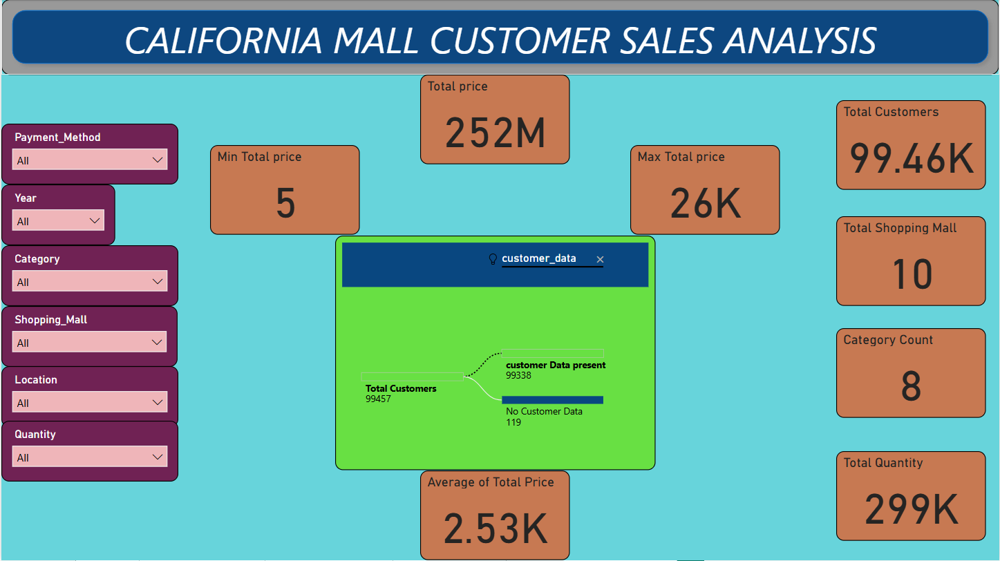

# **CALIFORNIA MALL CUSTOMERS SALES DATA ANALYSIS using MySQL and PowerBI**

## **Objectives of the Analysis:**

- Understand customer purchasing behavior based on age, gender, and payment method.
- Analyze sales data to identify trends by product category and mall location.
- Examine the impact of mall size and store count on sales performance.
- Explore how mall construction year relates to sales and customer footfall.

This analysis involves three interconnected datasets that provide insights into customer demographics, sales transactions, and shopping mall details in California. Below is a detailed breakdown of each dataset.

---

## **1. Customer Data**

The **customer_data.xlsx** file contains demographic and payment method information for mall customers. It includes the following columns:

| **Column Name**   | **Description**                             | **Data Type** | **Example Values**         |
|--------------------|---------------------------------------------|---------------|----------------------------|
| `customer_id`      | Unique identifier for each customer.         | *String*      | C241288, C111565            |
| `gender`           | Gender of the customer.                      | *String*      | "Male", "Female"            |
| `age`              | Age of the customer.                         | *Float*       | 20.0, 28.0, 66.0            |
| `payment_method`   | Payment method used for transactions.         | *String*      | "Credit Card", "Cash"       |

---

## **2. Sales Data**

The **sales_data.xlsx** file records transactional information, providing insights into purchase behavior. The key columns include:

| **Column Name**     | **Description**                                 | **Data Type** | **Example Values**         |
|----------------------|-------------------------------------------------|---------------|----------------------------|
| `invoice_no`         | Unique invoice number for each transaction.     | *String*      | I138884, I317333            |
| `customer_id`        | References the customer who made the purchase.  | *String*      | C241288, C111565            |
| `category`           | Product category purchased.                     | *String*      | "Clothing", "Shoes"         |
| `quantity`           | Number of items bought.                         | *Integer*     | 1, 3, 5                     |
| `invoice date`       | Date of the transaction.                        | *Date*        | "05/08/2022", "12/12/2021"  |
| `price`              | Total transaction price.                        | *Float*       | 1500.40, 3000.85            |
| `shopping_mall`      | Name of the shopping mall where the purchase was made. | *String*    | "South Coast Plaza"         |

---

## **3. Shopping Mall Data**

The **shopping_mall_data.xlsx** file provides details about various malls in California. It includes information about mall size, age, and location:

| **Column Name**       | **Description**                                   | **Data Type** | **Example Values**           |
|------------------------|---------------------------------------------------|---------------|------------------------------|
| `shopping_mall`        | Name of the shopping mall.                        | *String*      | "South Coast Plaza"           |
| `construction_year`    | Year the mall was constructed.                    | *Integer*     | 1967, 1982, 2002              |
| `area (sqm)`           | Total area of the mall in square meters.          | *Integer*     | 250000, 133000                |
| `location`             | City where the mall is located.                   | *String*      | "Los Angeles", "Santa Clara"  |
| `store_count`          | Number of stores in the mall.                     | *Integer*     | 140, 200, 270                 |

---

# **Importing and Cleaning California Mall Customers Sales Data Using MySQL**

This document explains the process of importing, cleaning, and transforming the **California Mall Customers Sales Data** into **MySQL** for better data integrity and analysis. The data consists of three datasets: **Customer Data**, **Sales Data**, and **Shopping Mall Data**.

---
# **Process of Importing Dataset into MySQL**  

The process of importing datasets into **MySQL** involves several sequential steps to ensure the data is properly loaded, cleaned, and transformed for analysis. Here’s a detailed breakdown of the entire process:  

---

## **1. Preparation of the Datasets**  
Before importing, ensure that the datasets are properly structured and free from basic formatting issues. Common checks include:  
- **File Format:** Ensure files are in a compatible format like **CSV**, **Excel**, or **SQL dump**.  
- **Consistent Column Names:** Make sure column names are standardized across related tables.  
- **No Special Characters:** Remove or encode special characters in text fields.  
- **Date and Number Formats:** Ensure dates follow a uniform format (e.g., **YYYY-MM-DD**) and numeric values do not contain commas.  

---

## **2. Setting Up the MySQL Database**  
Create a dedicated database to store the imported datasets. This helps organize tables logically.  

```sql
CREATE DATABASE california_mall;
USE california_mall;
Creating Tables in MySQL
Design the structure of tables based on the dataset schema. Define appropriate data types and constraints (e.g., PRIMARY KEY, NOT NULL, FOREIGN KEY).

Example – Creating a Customers Table:
sql
Copy
Edit
CREATE TABLE customers (
    customer_id VARCHAR(20) PRIMARY KEY,
    gender ENUM('Male', 'Female') NOT NULL,
    age INT CHECK (age >= 0),
    payment_method VARCHAR(50)
);
Define Primary Key: To uniquely identify records.

Set Data Constraints: To avoid invalid entries (e.g., CHECK constraints on age).

Set Data Types: INT for numbers, VARCHAR for text, DATE for dates.
4. Importing Data into MySQL Tables
Use MySQL Workbench or SQL Queries to import data from external files.

Method 1: Using MySQL Workbench
Right-click on the table and select "Table Data Import Wizard."

Browse and select the CSV or Excel file.

Map Columns to ensure data aligns with the table structure.

Execute the import process.

Finalizing the Import Process
After resolving import issues:

Ensure all tables are properly linked through Foreign Keys.

Backup the cleaned and final dataset for future use.

Export cleaned datasets if needed for further analysis in Power BI or other tools.
## **Data Cleaning and Transformation Process**

### **Cleaning Steps:**

1. **Handling Missing Values:**  
   - Replaced missing ages with the average age of all customers.  
   - Defaulted missing payment methods to **"Unknown"**.

2. **Removing Duplicates:**  
   - Eliminated duplicate records in the **Customers** and **Sales** tables.  

3. **Standardizing Data:**  
   - Formatted dates to **YYYY-MM-DD**.  
   - Standardized mall names to uppercase.

4. **Handling Outliers:**  
   - Removed unrealistic values such as negative prices and ages above 100.

---

### **Transformation Steps:**

1. **Adding Columns:**  
   - Created a **total_sales** column to reflect the value of each transaction.  

2. **Establishing Relationships:**  
   - Linked **Customers** and **Sales** tables using **customer_id**.  
   - Linked **Sales** and **Shopping Malls** tables using **shopping_mall**.

3. **Creating Views:**  
   - Developed views for **Total Sales per Mall** and **Customer Purchase Summary**.

---
 
- Illustrates the complete journey from raw data to transformed, analysis-ready datasets.  
- Shows how cleaning and transformation improve the quality and reliability of the final data.

--- 

# **Dashboard Explanation**

The dashboards in the **California Mall Customers Sales Data Analysis** offer detailed visualizations to better understand customer demographics, purchasing behavior, sales patterns, and shopping mall performance. Each dashboard focuses on a specific analytical aspect, providing insights into how various factors contribute to sales outcomes.

---

## **1. Overview**  
- This dashboard offers a broad overview of the dataset, presenting key statistics such as:  
  - Total number of transactions.  
  - Total sales volume.  
  - Number of unique customers and malls.  
  - Basic breakdown of demographics and product categories.  
- It helps identify general trends and provides a foundation for deeper analysis.  

  

---

## **2. Contribution of Customers**  
- This dashboard focuses on analyzing the demographic distribution and purchasing habits of customers.  
- Key insights include:  
  - Gender-wise distribution and spending patterns.  
  - Age group segmentation and its impact on sales.  
  - Analysis of preferred payment methods (Cash, Credit Card, etc.).  
- It helps identify which customer segments contribute the most to overall sales.  

  

---

## **3. Shopping Mall Analysis**  
- This dashboard explores the performance of different shopping malls in California.  
- Key metrics include:  
  - Mall size (area in sqm) and store count.  
  - Impact of construction year on mall popularity and sales.  
  - Location-wise comparison to see which cities drive the most sales.  
- It helps in understanding how mall characteristics affect revenue.  

  

---

## **4. Sales and Payment Analysis**  
- This dashboard provides insights into sales trends and how customers choose to pay.  
- Major insights include:  
  - Total sales volume over time.  
  - Most common payment methods and their popularity.  
  - Seasonal or monthly fluctuations in sales.  
- Useful for identifying which payment methods are preferred and how sales vary over time.  

  

---

## **5. Category and Quantity Analysis**  
- This dashboard focuses on product categories and the quantity of items purchased.  
- Key metrics include:  
  - Most popular product categories (e.g., Clothing, Electronics, Shoes).  
  - Analysis of purchase quantity and how it correlates with overall sales.  
  - Identifying top-selling categories and their contribution to total revenue.  
- Helps understand customer preferences and inventory performance.  

  

# **Conclusion**

The **California Mall Customers Sales Data Analysis** offers valuable insights into customer behavior, sales performance, and shopping mall dynamics. By examining key metrics such as demographic contributions, sales volume, payment methods, and mall characteristics, several important conclusions can be drawn:

---
The data cleaning and transformation process in **MySQL** significantly enhanced the dataset's integrity by handling missing values, removing duplicates, and creating meaningful relationships between tables. These efforts provided a strong foundation for reliable sales and customer behavior analysis. 

## **Key Findings:**

### 1. **Customer Demographics:**  
- Gender and age play significant roles in purchasing behavior.  
- Younger and middle-aged customers contribute the most to overall sales.  
- Credit cards appear to be the most preferred payment method, indicating a trend toward cashless transactions.  

### 2. **Sales Trends:**  
- Sales are not evenly distributed across all categories.  
- Categories such as **Clothing** and **Electronics** dominate the revenue share.  
- Quantity analysis reveals that larger purchases are more common during sales or seasonal periods.  

### 3. **Mall Performance:**  
- Larger malls with a higher store count (e.g., **South Coast Plaza**) tend to generate more sales.  
- Malls constructed more recently show slightly better performance, possibly due to modern facilities and better retail options.  
- Location also plays a vital role; malls located in urban areas outperform those in suburban locations.  

### 4. **Payment and Transaction Analysis:**  
- Credit card payments make up a significant portion of transactions, reflecting customer preference for convenience.  
- Sales volume fluctuates seasonally, with peaks during holidays and end-of-season sales.  

---

## **Business Implications:**

- **Targeted Marketing:**  
  - Malls and retailers should focus on younger demographics and tailor promotions around popular categories like **Clothing** and **Electronics**.  

- **Mall Development:**  
  - Investing in larger malls with diverse store offerings can improve foot traffic and sales.  
  - Malls in urban areas with high population density are likely to yield better returns.  

- **Promotional Strategies:**  
  - Seasonal promotions and discounts can effectively boost sales volume.  
  - Loyalty programs incentivizing credit card payments could enhance customer retention.  

---

## **Final Thoughts:**  

This analysis provides a comprehensive understanding of how different variables impact mall sales performance. Leveraging these insights can help retailers, mall management, and marketers make data-driven decisions to optimize sales and improve customer satisfaction. Further analysis, such as predictive modeling, could help forecast sales and better prepare for future market trends.  

